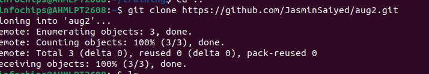

Task01
Step 1: Initialize the Git Repository

    Create a New Git Repository
        Create a new repository on GitHub, GitLab, or any other Git hosting service.

    Clone the Repository
        Clone the repository to your local machine.
    
Step 3: Create Initial Commit

    Add Files to Git
        Add all files to the Git repository.

Commit Changes

    Commit the changes to the repository.
Push to Remote Repository

    Push the changes to the remote repository.
Step 4: Implement Branching Strategy

    Create Branches for Development, Testing, and Production

Step 5: Merge Strategy

    Development Workflow
        Developers work on the development branch and create feature branches for new features or bug fixes.
        

-git add

git commit & push

